# Free Form Certificate

A WordPress plugin for issuing PDF certificates from forms and proving they are genuine. Around that core it covers appointment booking, room and group calendars, reregistration campaigns, public-tender candidate queues, short URLs, QR codes and date-based e-mails such as birthday greetings.

Every module, certificates included, can be switched on or off. The complete reference (every token, shortcode, capability and setting) ships inside the plugin under **FFC Settings → Documentation**.

**Requires** WordPress 6.8 or later and PHP 8.3 or later · **License** GPLv3 or later

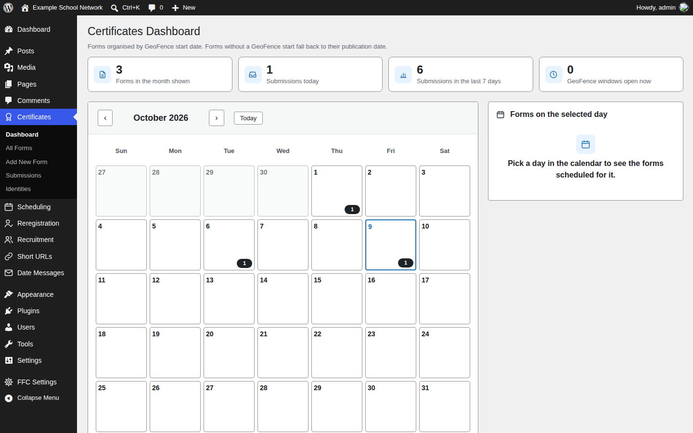

## Certificates

Build a form, design the certificate in HTML with placeholders such as `{{name}}`, `{{auth_code}}` and `{{qr_code}}`, and place the form anywhere with a shortcode. The PDF is generated in the participant's browser. Each certificate carries an authentication code and a QR code that open its verification page, and the participant receives a one-click magic link by e-mail.

| Form builder | Certificate preview |
| --- | --- |
| 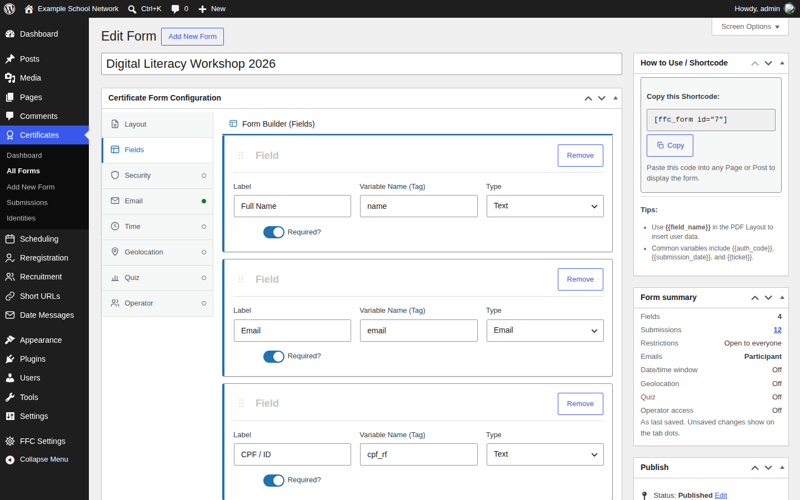 | 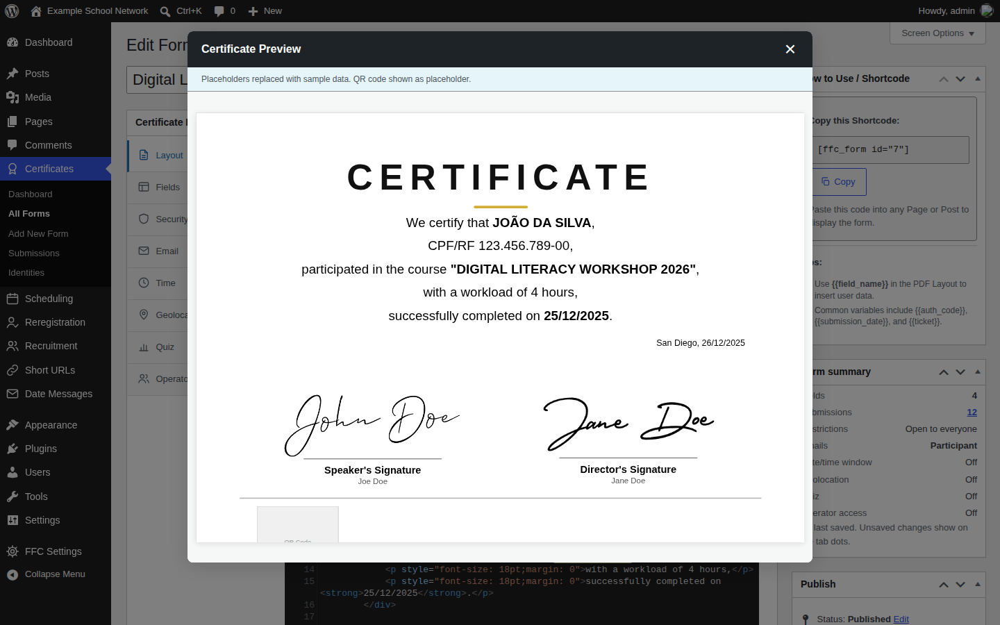 |

| Public form | Verification page |
| --- | --- |
| 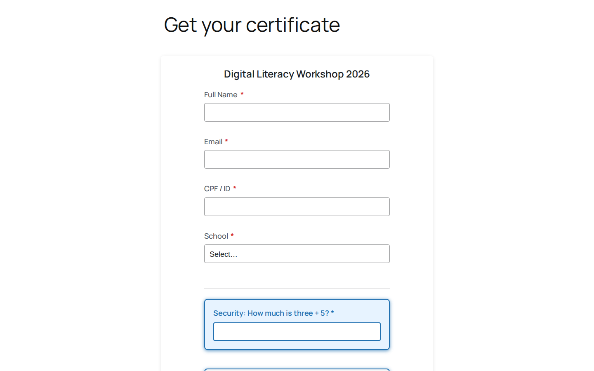 | 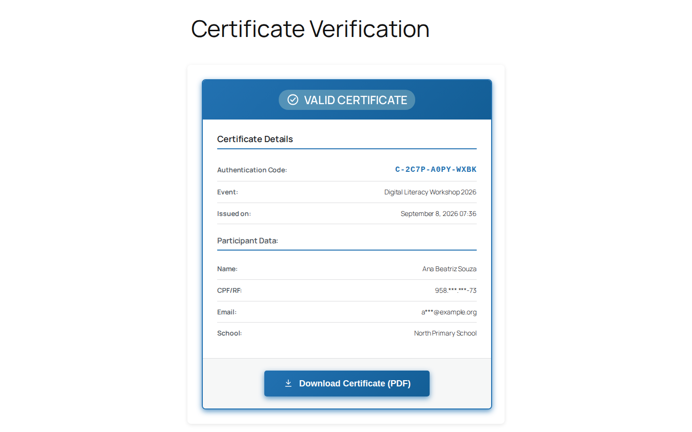 |

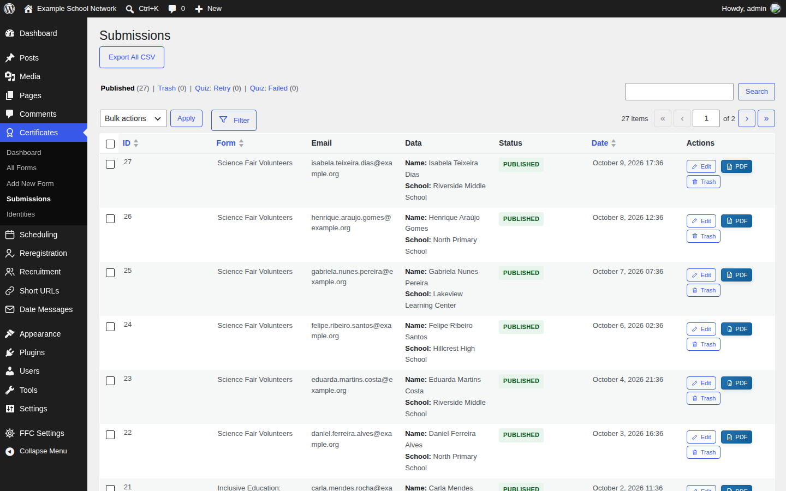

Forms can be restricted by allowlist, denylist, single-use tickets, a date and time window or geofencing. They can also run as a scored quiz and limit how many certificates one device may issue. Every public form has a honeypot plus a math challenge, an ALTCHA proof-of-work challenge, or both.

## Scheduling

**Personal calendars** let people book a time slot with a person or a service: business hours, slot length, capacity, approval, waitlists, reminders and PDF receipts. **Audience calendars** book rooms and other shared spaces for whole groups, with conflict detection and holidays.

| Booking calendar | Room calendar |
| --- | --- |
| 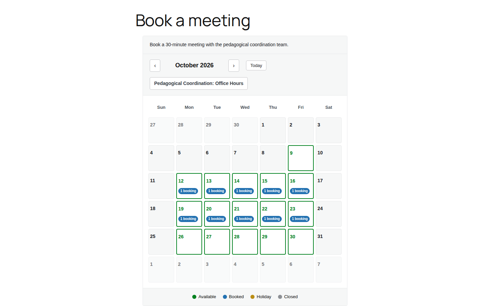 | 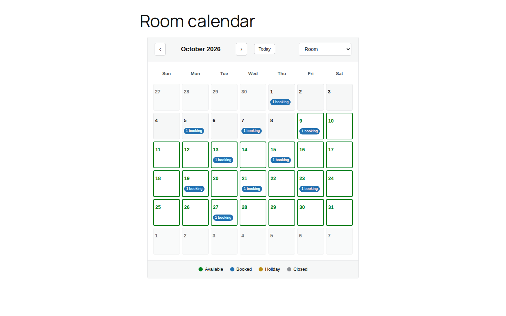 |

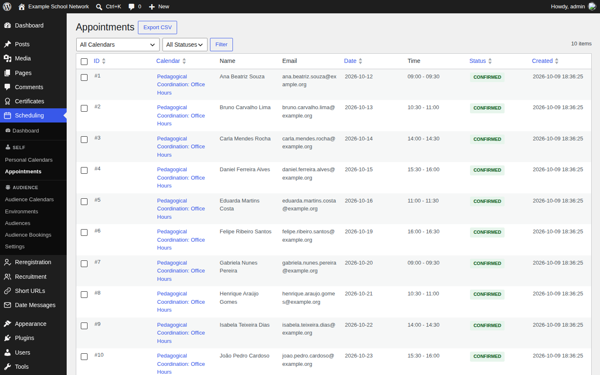

## Date Messages

Automatic e-mails built from a date in each person's profile, such as a birthday, sent on the day or a set number of days before. Each rule has its own audiences, subject and body, and the body can take a background image with the text in a column beside it. You can preview who would receive a rule, and the message itself, before anything is sent. An optional digest reports each run to the people you choose.

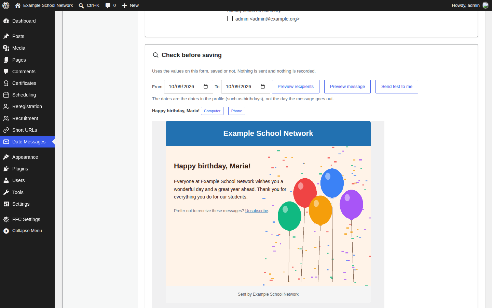

## Short URLs and QR codes

A built-in short-link domain with click counts, plus a QR code generator for links, text, Wi-Fi, e-mail, phone, SMS, WhatsApp, contact cards, social profiles and calendar events. One QR design (shapes, colours, logo, frame) applies to certificates, magic links and short URLs alike.

| QR code generator | Short URLs |
| --- | --- |
| 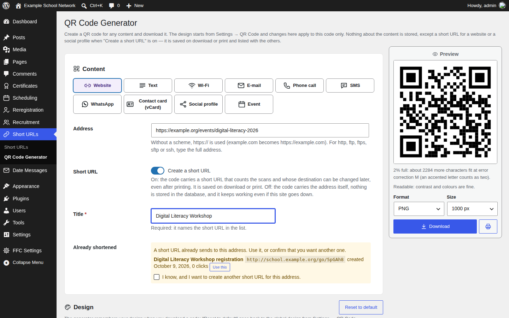 | 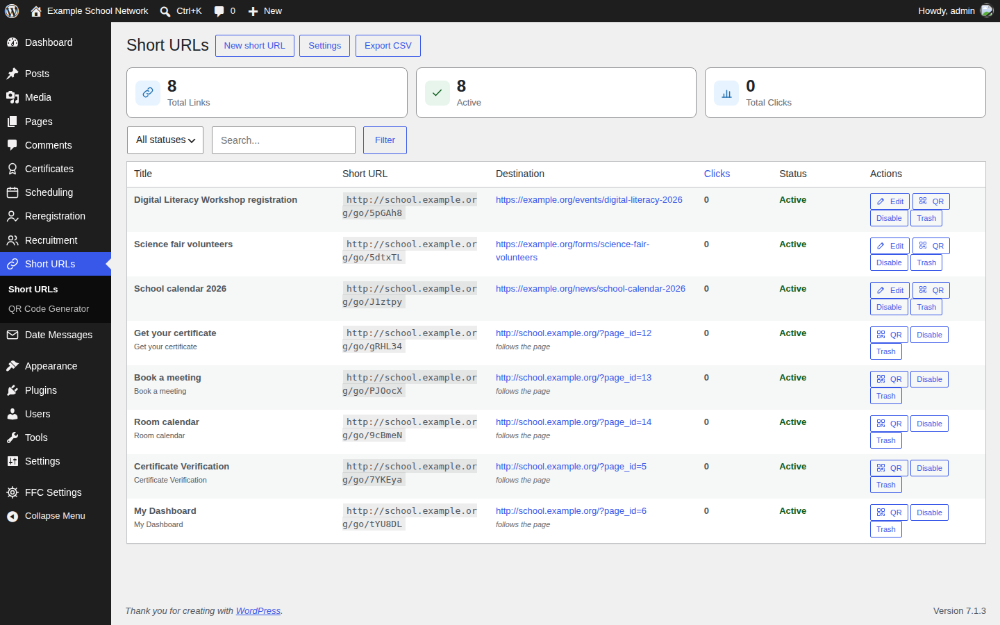 |

## More

- **User dashboard:** a front-end page where each person finds their certificates, appointments, group events, reregistrations and profile.
- **Reregistration:** campaigns with per-audience custom fields, approval and PDF records.
- **Recruitment:** public-tender notices, candidate classification lists, convocations and a public queue.
- **Privacy:** e-mail, CPF/RF, IP addresses and other sensitive fields are encrypted at rest, and a reveal is logged.
- **Administration:** granular capabilities (hidden, view only, view and edit), an activity log, batched CSV exports, data migrations, a scheduled-tasks screen that generates the server cron line, and one e-mail layout shared by every message.
- **Dark mode:** for the plugin's admin screens and public pages, either always on or following the operating system.

| User dashboard | Dark mode |
| --- | --- |
| 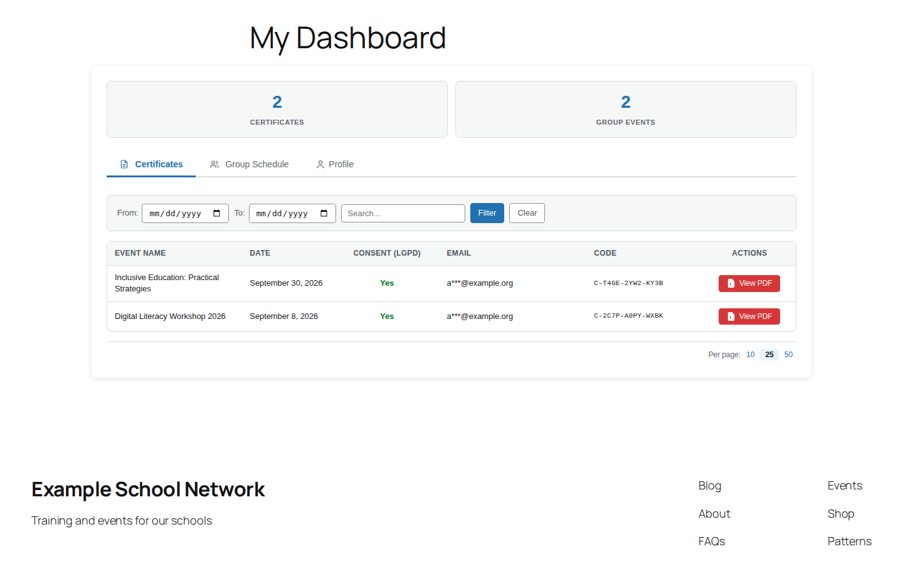 | 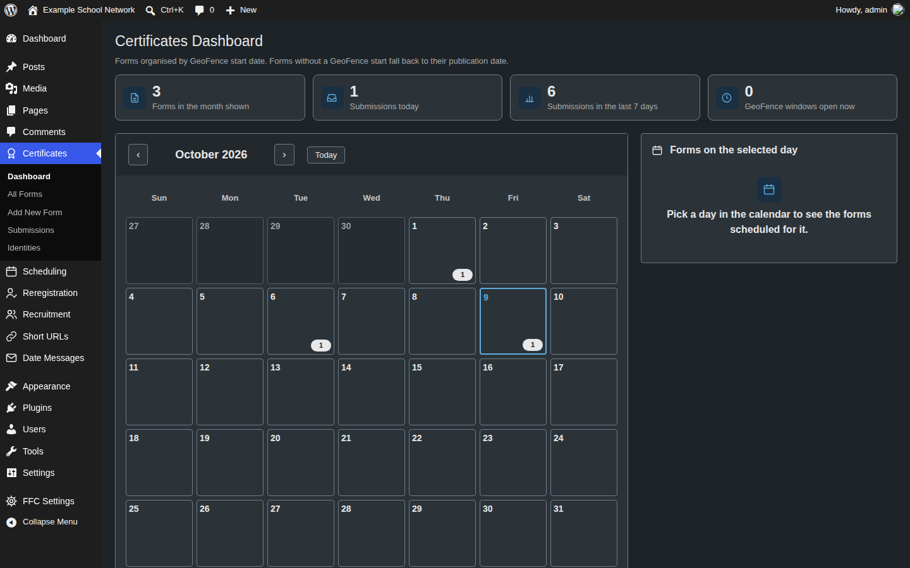 |

## Installation

1. Download `ffcertificate-X.Y.Z.zip` from the [latest release](https://github.com/rpgmem/ffcertificate/releases/latest).
2. In WordPress, go to **Plugins → Add New → Upload Plugin**, choose the zip and activate it.
3. Go to **Certificates → Add New Form**, build the form and copy its shortcode into a page.

Later updates arrive through the normal WordPress update screen, straight from this repository's releases, and each package is checked against its SHA-256 before it is installed.

For reliable timing of scheduled e-mails, install the server cron line shown under **FFC Settings → Scheduled Tasks**. On nginx, also see [docs/DEPLOYMENT.md](docs/DEPLOYMENT.md).

## Documentation and contributing

- [CHANGELOG.md](CHANGELOG.md): what changed in each release.
- [CONTRIBUTING.md](CONTRIBUTING.md): how to set up the project, run the checks and send a change.
- [SECURITY.md](SECURITY.md): how to report a vulnerability.

Every screenshot above comes from a throwaway WordPress filled with invented people and data. `.github/scripts/screenshots/` holds the two scripts that rebuild them, `seed.php` and `capture.mjs`.

A Portuguese (Brazil) translation is included, and the plugin is ready for others under the `ffcertificate` text domain.
